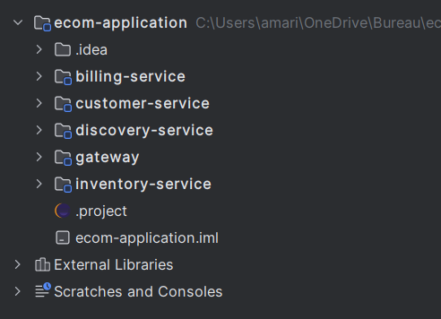
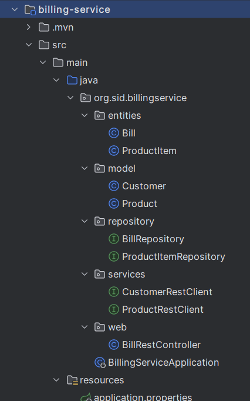
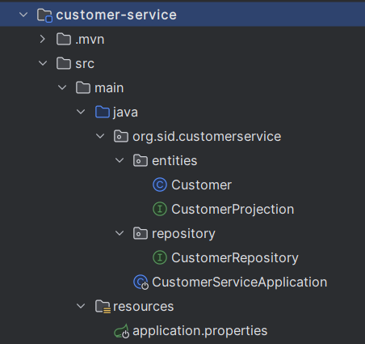
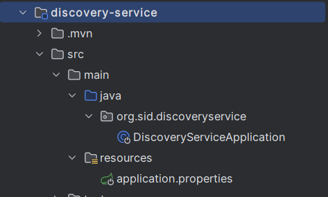
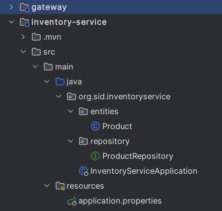
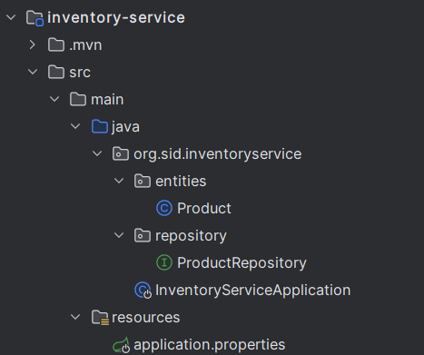
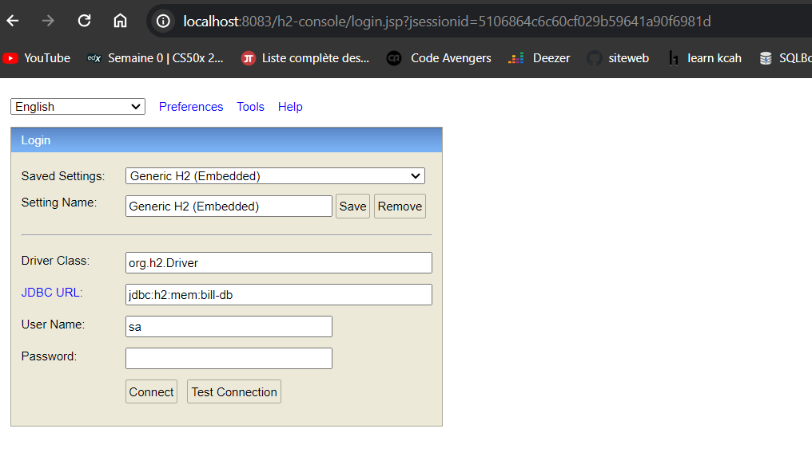
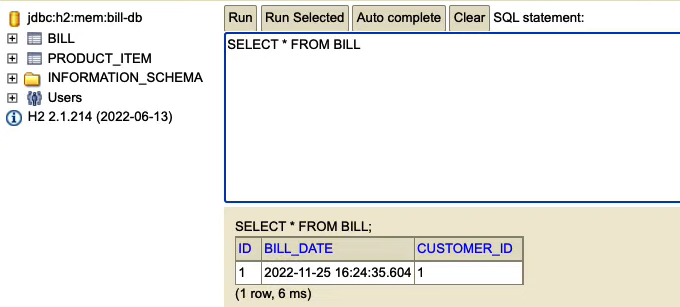
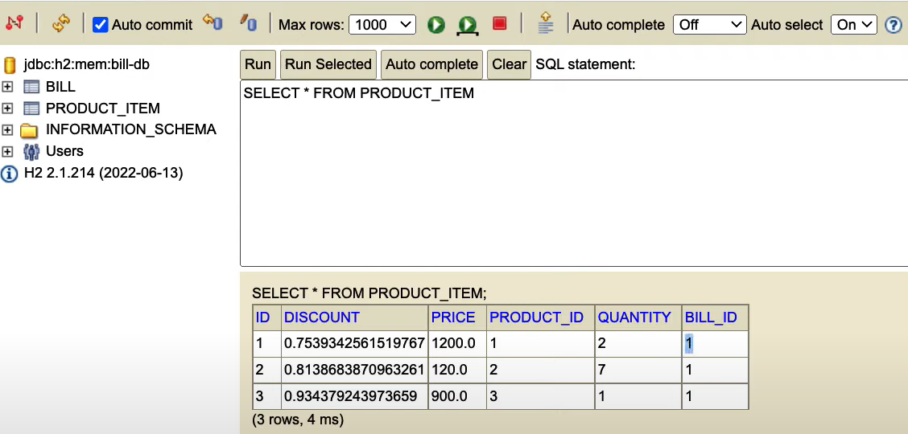

<h2 style="color:LightBlue ;font-family: italic;text-decoration: green wavy underline;">Micro Services Architecture Use case with Spring Coud <h2>
<h4 style="color:LightSkyBlue">L'application Ecom<h4>
 
<h4 style="color:white; font-family: italic">Billing Service<h4>

<h4 style="color:white; font-family: italic">Customer Service<h4>

<h4 style="color:white; font-family: italic">Discovery Service<h4>

<h4 style="color:white; font-family: italic"><h4>

<h4 style="color:white; font-family: italic">Inventory Service<h4>

<h4 style="color:white; font-family: italic">H2 Console<h4>

